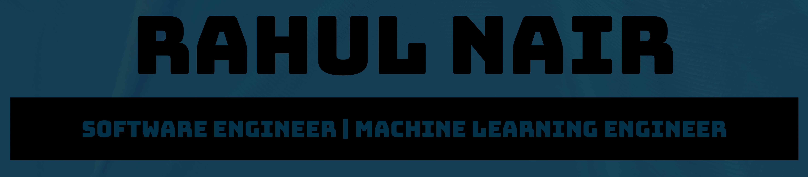

<!-- ## Hi there 👋, I am Rahul! -->

## About Me

I am a Software Engineer and an aspiring Machine Learning Engineer. I recently obtained a
Master’s in Advanced Computer Science. I have 3 years of professional experience developing,
testing and deploying scalable and modular software solutions. I have experience in conducting
academic research in the field of Computer Vision. Currently, I am seeking an opportunity to
leverage my Software Engineering expertise and recently acquired skills and knowledge in the
field of Machine Learning to develop intelligent systems and software solutions

## Skills

### Languages & tools

### Frameworks & libraries

## Academic Projects

[Monocular Depth Estimation](https://github.com/rnair1607/msc23-depth-estimation-indoor) 
<b>Tech Stack: Python, PyTorch, Cuda, Pandas</b> 
Description: Academic research and contribution to the topic of Monocular Depth Estimation in a Single RGB image using Deep Learning Technologies, implemented in Python with Deep Learning framework PyTorch.

[TestData Generation](https://github.com/rnair1607/CS547_assignment3) 
<b>Tech Stack: Python</b> 
Description: Test Data generation using Genetic Algorithms implemented in Python.

[Spotify Popularity Regression](https://github.com/rnair1607/spotify_regression_competition) 
<b>Tech Stack: Python. Machine Learning models, Pandas, Numpy</b> 
Description: Test Data generation using Genetic Algorithms implemented in Python.

[Portfolio Optimization](https://github.com/rnair1607/portfolio-opitmisation-R) 
<b>Tech Stack: R</b> 
Description: Portfolio Optimization using Genetic Algorithms, implemented in R.

[Algorithmic Trading]() 
<b>Tech Stack: R, Deep Learning</b> 
Description: Algorithmic Trading using Deep Learning models and R.

## Personal Projects

[ToDo app](https://github.com/rnair1607/toDo) 
<b>Tech stack: VueJS, VueX, TailwindCSS, HTML5, CSS3 and JavaScript</b> 
Description: A Web app implemented in VueJS. This project demonstrates my proficiency in JavaScript, HTML and CSS. I worked on this project in my endeavour to be more proficient in JavScript Technologies. This application uses VueX for state management with VueJS 2 and TailwindCSS.

[Animated cards](https://github.com/rnair1607/AnimatedCards) 
<b>Tech Stack: HTML5, CSS3 and JavaScript</b> 
Description: A small web app implemented with Vanilla JavaScript, CSS3 and HTML5 to demonstrate my proficiency in CSS animation.

[Flutter Quiz](https://github.com/rnair1607/flutter-quiz) 
<b>Tech Stack: Dart and Flutter</b> 
Description: A cross-platform mobile quiz app implemented in Flutter to demonstrate my skills in Dart programming language.

[Moment](https://github.com/rnair1607/Moment) 
<b>Tech Stack: AWS, NodeJS, ExpressJS, MongoDB, Bootstrap, ReactJS, HTML5, CSS3 and JavaScript</b> 
Description: A full-stack web application implemented with ReactJS for the frontend, NodeJS with ExpressJS for the backend REST APIs and MongoDB for the DataBase. It is a web app to store moments on a time-to-time basis and allows all the CRUD operations. It also uses cloud services such as S3 buckets to store images and files which are uploaded to the web application.

[Okta Test](https://github.com/rnair1607/okta-test) 
<b>Tech Stack: ReactJS and Okta SDK</b> 
Description: A ReactJS web app to test and implement the React Okta SDK for authentication and authorization.

[Github Finder](https://github.com/rnair1607/github-finder-react) 
<b>Tech Stack: ReactJS, HTML5, CSS3 and JavaScript</b> 
Description: A ReactJS web app which uses publicly available GitHub endpoints to find GitHub profiles and Repositories.

[Uber Eats Clone](https://github.com/rnair1607/uber-eats-clone-react-native) 
<b>Tech Stack: Yelp API and React Native</b> 
Description: A cross-platform Uber Eats Clone implemented in React Native with publicly available Yelp APIs.

[Great Places](https://github.com/rnair1607/great-places-app-react-native) 
<b>Tech Stack: React Native</b> 
Description: A cross-platform mobile app implemented in React Native that uses mobile hardware and sensors to capture and save images in the phone. An offline SQL database is used to store the images on the device.

[Shop App](https://github.com/rnair1607/shop-app-react-native) 
<b>Tech Stack: React Native</b> 
Description: A cross-platform mobile app implemented in React Native to reproduce the CRUD operation for a shop application.

[Meals app](https://github.com/rnair1607/meals-app-react-native) 
<b>Tech Stack: React Native</b> 
Description: A React Native app to showcase, add, update and delete recipes.

[Go Rest](https://github.com/rnair1607/golangrestapi) 
<b>Tech Stack: GoLang</b> 
Description: RESTful APIs implemented in Go to perform basic CRUD operations.

[Social Media Server](https://github.com/rnair1607/socialMediaServer) 
<b>Tech Stack: NodeJS, GraphQL and MongoDB</b> 
Description: Social Media Server implemented in NodeJS with GraphQL APIs to perform CRUD operations for social media posts.

[Chatroom](https://github.com/rnair1607/chatRoomReact) 
<b>Tech Stack: React, NodeJS, Web socket and MongoDB</b> 
Description: A full-stack web Chat app implemented with ReactJS in the frontend and NodeJS with Web sockets and MongoDB in the backend.

[BoliaAndSons](https://github.com/rnair1607/boliaAndSons) 
<b>Tech Stack: ReactJS, HTML5, CSS3</b> 
Description: A portfolio website for a business implemented in ReactJS.

[Wave Music](https://github.com/rnair1607/wave-music) 
<b>Tech Stack: ReactJS and Styled components</b> 
Description: A music player implemented with ReactJS and styled components.

## Work Experience

### PROFESSIONAL 1 SOFTWARE ENGINEER

<b>DXC Technology: 2021-2022</b> 

<i>Responsibilities</i>

- Application development using Microservices architecture.
- Creation and implementation of MongoDB Schema.
- Build frontend application using ReactJS with Electron.
- Implementation of state management tools like Redux and ContextAPI in the Frontend App.
- Integration and implmentation of authentication using OAuth2 with OKTA React SDK and out-of-the-box react Hooks
  implementation of OKTA endpoints to work with Private URI scheme in the frontend application.
- Development of RESTful APIs using Springboot framework to manipulate and access data.
- Implementation of CI/CD pipeline using Jenkins in a Kubernetes cluster to publish Dev and Test builds.
- GIT for version control.
- Follow Agile methodology.

---

### ASSOCIATE PROFESSIONAL SOFTWARE ENGINEER

<b>DXC Technology: 2019-2021</b> 

<i>Responsibilities</i>

- Web app development using frontend technologies like Angular 13 with RxJS for the migration project
  and VueJS with VueX.
- Implmenentation of Unit Test scripts for the frontend application using Jest.
- Microservices development for web apps using NodeJS with ExpressJS and
  PostgreSQL.
- Work with Jira to track User Story points and Bugs.
- Map and refin 15+ story points in a month.
- Implementation of the CI/CD pipeline using GitHub actions.

<!--
**rnair1607/rnair1607** is a ✨ _special_ ✨ repository because its `README.md` (this file) appears on your GitHub profile.
Here are some ideas to get you started:

- 🔭 I’m currently working on ...
- 🌱 I’m currently learning ...
- 👯 I’m looking to collaborate on ...
- 🤔 I’m looking for help with ...
- 💬 Ask me about ...
- 📫 How to reach me: ...
- 😄 Pronouns: ...
- ⚡ Fun fact: ...
  -->
